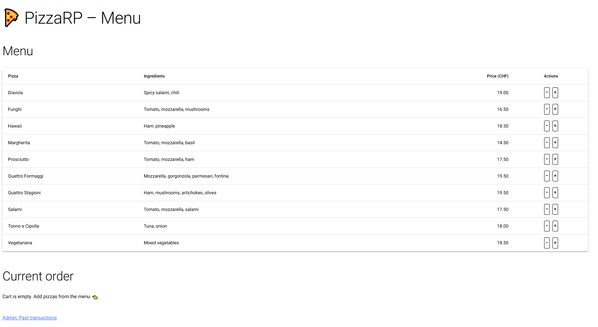
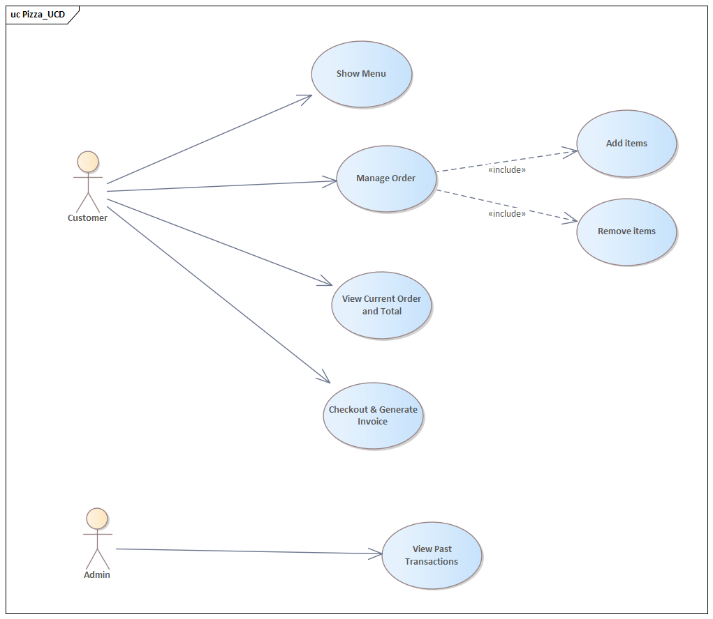
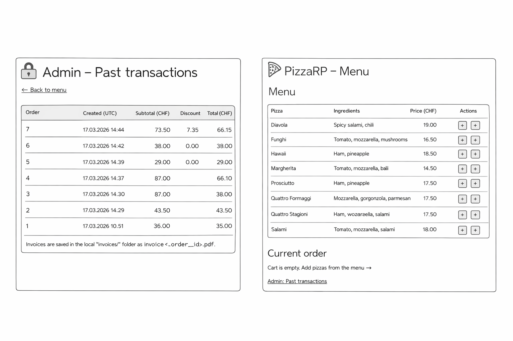
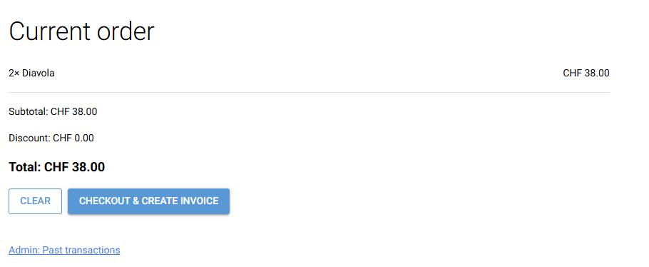

> 🚧 This is a template repository for student projects in the course Advanced Programming at FHNW, BSc BIT.  
> 🚧 Do not keep this section in your final submission.

---

# 🍕 PizzaRP – Pizzeria Reference Project (Browser App)

> 🚧 Replace the screenshot with one that shows your main screen.



---

This project is intended to:

- Practice the complete process from **application requirements analysis to implementation**
- Apply advanced **Python** concepts in a browser-based application (NiceGUI)
- Demonstrate **data validation**, a clean architecture (presentation / application logic / persistence), and **database access via ORM**
- Produce clean, well-structured, and documented code (incl. tests)
- Prepare students for **teamwork and professional documentation**
- Use this repository as a starting point by importing it into your own GitHub account  
- Work only within your own copy — do not push to the original template  
- Commit regularly to track your progress

---

# 🍕 TEMPLATE for documentation

> 🚧 Please remove the paragraphs marked with "🚧". These are comments for preparing the documentation.

---

## 📝 Application Requirements

---

### Problem

> 🚧 Describe the real-world problem your application solves. (Not HOW, but WHAT)

💡 Example: In a small local pizzeria, the staff writes orders and calculates totals by hand. This causes mistakes and inconsistent orders or discounts.

---

### Scenario

> 🚧 Describe when and how a user will use your application

💡 Example: PizzaRP solves the part of the problem where orders and totals are created by letting a user select items from a menu, validating the inputs, storing orders in a database, and automatically generating a correct invoice.

---

## User Stories

### 1. View Quiz Menu
**As a user, I want to be able to choose between Digital Business (DIB) Quizes and Principles of Management (POM) Quizes**  
**Description:** The application displays a menu and choice of quizes for the user to select
**Inputs:**  The user can choose between two types of quizes
**Outputs:** Confirmation of choice (internally calling selected quiz) 

### 2. Select and run a quiz 
**As a user, I want to be able to quiz my knowledge in DIB or POM**  
**Description:** The application displays a collection of quiz questions and the a multiple choice selection of answers  
**Inputs:**  Choice of an answer (Four choices) 
**Outputs:** Confirmation of choice and correction if incorrect (internally: "list[attempt_answers]) 

### 3. Select the difficulty of quiz 
**As a user, I want to select the difficulty of the previously selected subject in order to challenge and improve my current knowledge**  
**Description:** The application displays a menu with three possible difficulties (Easy, Medium and Hard) and a choice for a random selection of questions for the user to select and proceed with
**Inputs:**  Choice of difficulty option (Three choices plus random choice)
**Outputs:** Confirmation of choice (internally calling the next step in quiz_setup)

### 4. Select the individual topics within the subject itself
**As a user, I want to select the topic within the previously selected subject and quiz my knowledge in the selected topics only in order to focus my learning goals and possible weaknesses**  
**Description:** The application displays available topics within the database in a menu, including a random option of questions 
**Inputs:**  Choice of a single topic 
**Outputs:** Confirmation of choice (internally calling the next step in quiz_setup)

### 5. Quit and return to main menu 
**As a user, I want to able to return to the menu at anytime in order to restart my quiz setup and the quiz itself**  
**Description:** At all times, during the quiz setup and the quiz attempt itself, the user has the possibility to return to the starting menu
**Inputs:**  User has a return choice
**Outputs:** Confirmation of choice (internally, stop attempt and return to )

### 6. Point Counter
**As a user, I want a point counter/final grade/percentage presented, in order to check my performance.**  
**Description:** The application displays the results of the finished attempt and shows the score (correct questions out of total), grade and percentage.
**Inputs:**  internally recognizing the users choice and adding to counter if correct choice has been selected
**Outputs:** internally calling the results.csv and creating a new entry with achieved score, date, time, final grade and percentage reached 

### 7. Scoreboard (Arcade Format)
**As a User, I want to be able to see my score in a scoreboard with other local users in order to compare my final attempt score with previous attempts**  
**Description:** Once an attempt is complete, the user is able to view their score and input a user name into a scoreboard
**Inputs:**  Username entry ("str" and limited characters, excluding special characters)
**Outputs:** Confirmation of choice (internally: results.csv)

**Possible improvements**

### 8. Admin Rights
**As an Admin, I want to be able to add and remove questions, in order to keep the quiz relevant.**  
**Description:** 
**Inputs:**  
**Outputs:** 

---

### 2. Manage Order and View Running Total
**As a user, I want to add or remove pizzas and see the running total.**  
**Description:** The user adds or removes pizzas from the current order, and the totals update automatically.  
**Inputs:** pizza ID as `int`, action as `add | remove`  
**Outputs:**  
- updated cart/order  
- subtotal as `float`  
- discount as `float`  
- total as `float`  

---

### 3. Automatic Discount
**As a user, I want a discount of 10% to be applied automatically if the subtotal exceeds 50 CHF.**  
**Description:** The application checks the subtotal and applies the discount automatically when the threshold is reached.  
**Inputs:** subtotal as `float`  
**Outputs:**  
- discount as `float`  
- total as `float`  

---

### 4. Generate Invoice
**As a user, I want an invoice to be created and saved as a file.**  
**Description:** After checkout, the application generates and stores an invoice file.  
**Inputs:** completed order/cart  
**Outputs:**  
- invoice file (PDF)  
- invoice file path as `str`  

---

### 5. View Past Transactions (Admin)
**As an admin, I want to see past transactions ordered by date.**  
**Description:** The admin can view saved orders sorted by date.  
**Inputs:** optional limit as `int`  
**Outputs:** transaction list displayed (internally: `list[Order]`)  

---

### Use cases

> 🚧 Name actors and briefly describe each use case. Ideally, a UML use case diagram specifies use cases and relationships.



**Use cases**
## Main Use Cases

- Show Menu (Customer)  
- Manage Order (Customer)  
  - Add items  
  - Remove items  
- View Current Order and Total (Customer)  
- Checkout & Generate Invoice (Customer)  
- View Past Transactions (Admin)  

**Actors**
- Customer (places orders)
- Admin (reviews transactions)

---

### Wireframes / Mockups

> 🚧 Add screenshots of the wireframe mockups you chose to implement.



---

## 🏛️ Architecture

> 🚧 Document the architecture components, relationships, and key design decisions.

### Software Architecture

> 🚧 Insert your UML class diagram(s). Split into multiple diagrams if needed.


**Layers / components:**
- UI (NiceGUI pages/components, browser as thin client)
- Application logic (controllers + domain/services)
- Persistence (SQLite + ORM entities + repositories/queries)

**Design decisions (examples):**
- Organize code using **MVC**:
   - **Model:** domain + ORM entities (e.g. `models.py`)
   - **View:** NiceGUI UI components/pages
   - **Controller:** event handlers and coordination logic between UI, services, and persistence
- Separate UI (`app/main.py`) from domain logic (e.g. `pricing.py`) and persistence (e.g. `models.py`, `db.py`)
- Use and interaction of modules to minimize dependencies, by minimizing cohesion and maximizing coupling
- Keep business rules testable without starting the UI

**Design patterns used (examples):**
- MVC (Model–View–Controller)
- Repository/DAO for database access (e.g. `queries.py`)
- Strategy for business rules (e.g. discount calculation)
- Adapter for external services (e.g. invoice generation backend)

---

### 🗄️ Database and ORM

> 🚧 Describe the database and your ORM entities. Ideally, a diagram documents the database and it is described together with the ORM entities.


**ORM and Entities (example):** In the database, order are stored in ... that are mapped an `Order` entity. The `Order` ↔ `OrderItem` relationship ... ensures that an `Order` has at least one `OrderItem` and an `OrderItem` always relates to an `Order`.

---

## ✅ Project Requirements

---

> 🚧 Requirements act as a contract: implement and demonstrate each point below.

Each app must meet the following criteria in order to be accepted (see also the official project guidelines PDF on Moodle):

1. Using NiceGUI for building an interactive web app
2. Data validation in the app
3. Using an ORM for database management

---

### 1. Browser-based App (NiceGUI)

> 🚧 In this section, document how your project fulfills each criterion.

The application interacts with the user via the browser. Users can:

- View the pizza menu
- Select pizzas and quantities
- See the running total
- Receive an invoice generated as a file

**Architecture note (per SS26 guidelines):** the browser is a thin client; UI state + business logic live on the server-side NiceGUI app.

---

### 2. Data Validation

The application validates all user input to ensure data integrity and a smooth user experience.
These checks prevent crashes and guide the user to provide correct input, matching the validation requirements described in the project guidelines.

---

### 3. Database Management

All relevant data is managed via an ORM (e.g. SQLModel or SQLAlchemy). For the pizza example this includes users, pizzas, and orders.

---

## ⚙️ Implementation

---

### Technology

- Python 3.x
- Environment: GitHub Codespaces
- External libraries: nicegui, sqlmodel, sqlalchemy, reportlab, python-dotenv, pytest, tzdata

---

### 📂 Repository Structure

```text
pizza-app/
├─ README.md
├─ pyproject.toml
├─ .env.example
├─ .gitignore
│
├─ pizza_app/
│  ├─ __main__.py               # entrypoint (py -m pizza_app)
│  ├─ application.py            # composition root
│  │
│  ├─ domain/
│  │  └─ models.py
│  │
│  ├─ infra/
│  │  ├─ db.py
│  │  ├─ repositories.py
│  │  └─ seed.py
│  │
│  ├─ services/
│  │  ├─ pricing.py
│  │  └─ invoice.py
│  │
│  ├─ ui/
│  │  ├─ pages.py
│  │  └─ controllers.py
│
├─ docs/
│  ├─ ui-images/
│  │  ├─ ui_showcase.png
│  │  ├─ ui_menu.png
│  │  ├─ ui_checkout.png
│  │  ├─ wireframe_home.png
│  │  └─ wireframe_checkout.png
│  │
│  └─ architecture-diagrams/
│     ├─ uml_use_case_diagram.png
│     ├─ uml_class_architecture.png
│     ├─ uml_class_domain.png
│     ├─ uml_class_persistence.png
│     └─ er_diagram.png
│
├─ data/                        # sqlite DB (gitignored)
├─ invoices/                    # generated PDFs (gitignored)
│
└─ tests/
   ├─ conftest.py
   ├─ test_pricing.py
   └─ test_checkout_and_invoice.py
```

---

### How to Run

> 🚧 Adjust to your project.

### 1. Project Setup
- Python 3.13 (or the course version) is required
- Create and activate a virtual environment:
   - **macOS/Linux:**
      ```bash
      python3 -m venv .venv
      source .venv/bin/activate
      ```
   - **Windows:**
      ```bash
      python -m venv .venv
      .venv\Scripts\Activate
      ```
- Install dependencies:
   ```bash
   pip install -r requirements.txt
   ```

### 2. Configuration
- E.g., setup of parameters or environment variables

### 3. Launch
- Start the NiceGUI app (example):
   ```bash
   py -m pizza_app
   ```
- Open the URL printed in the console.

### 4. Usage (document as steps)

> 🚧 Describe the usage of the main functions

Order Pizza:
1. Open the menu page and browse pizzas.
2. Add items (with quantities) to the current order.
3. Review total (incl. discounts) and validate inputs.
4. Checkout to persist the order and generate the invoice.

> 🚧 Add UI screenshots of the main screens (or a short video link):




---

## 🧪 Testing

> 🚧 Explain what you test and how to run tests.

**Test mix:**
- Overall 12 tests
- 6 Unit tests: e.g. subtotal calculation, discount application above CHF 50, no discount at or below threshold, total calculation
- 3 DB tests: e.g. menu query returns seeded pizzas, saving an order persists order + order items, empty DB / empty transactions behavior
- 3 Integration tests: e.g. checkout with one pizza creates order and invoice, checkout with multiple pizzas applies discount correctly

**Template for writing test cases**
1. Test case ID – unique identifier (e.g., TC_001)
2. Test case title/description – What is the test about?
3. Preconditions: Requirements before executing the test
4. Test steps: Actions to perform
5. Test data/input
6. Expected result
7. Actual result
8. Status – pass or fail
9. Comments – Additional notes or defect found

**Run:**
```bash
pytest
```

> 🚧 If you provide separate commands, document them here (e.g. `pytest -m integration`).

---

### Libraries Used

- see above

## 👥 Team & Contributions

---

> 🚧 Fill in the names of all team members and describe their individual contributions below.

| Name      | Contribution |
|-----------|--------------|
| Student A | NiceGUI UI + documentation |
| Student B | Database & ORM + documentation |
| Student C | Business logic + documentation |

---

## 🤝 Contributing

---

> 🚧 This is a template repository for student projects.  
> 🚧 Do not change this section in your final submission.

- Use this repository as a starting point by importing it into your own GitHub account
- Work only within your own copy — do not push to the original template
- Commit regularly to track your progress

---

## 📝 License

---

This project is provided for **educational use only** as part of the Advanced Programming module.

[MIT License](LICENSE)
