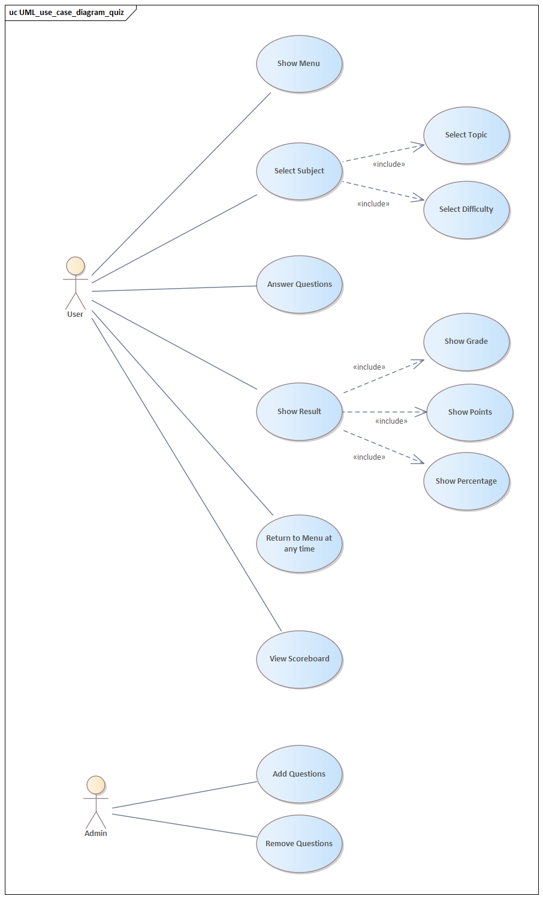
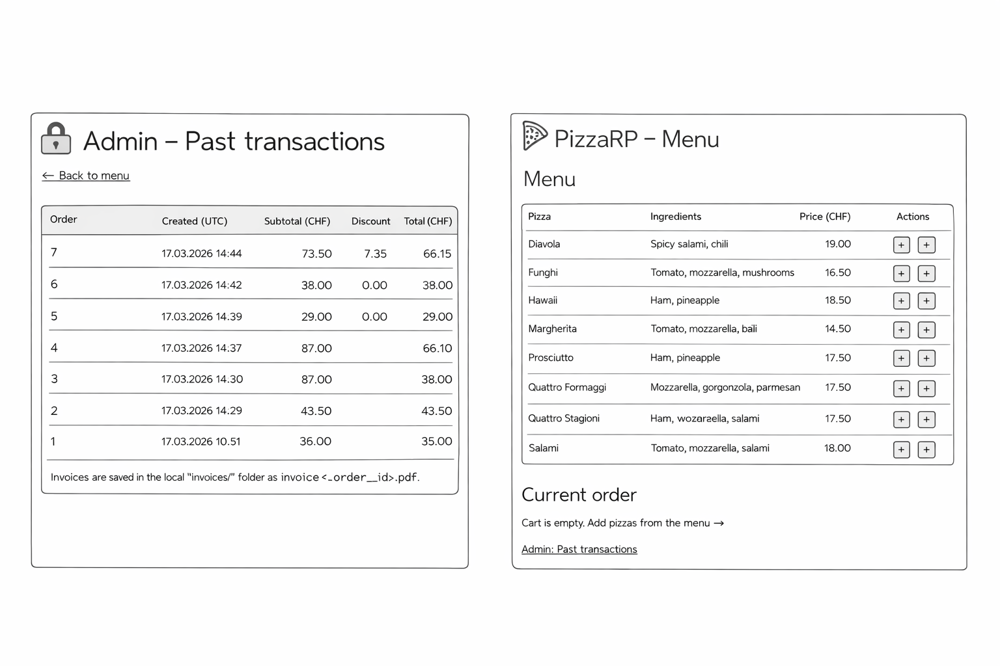
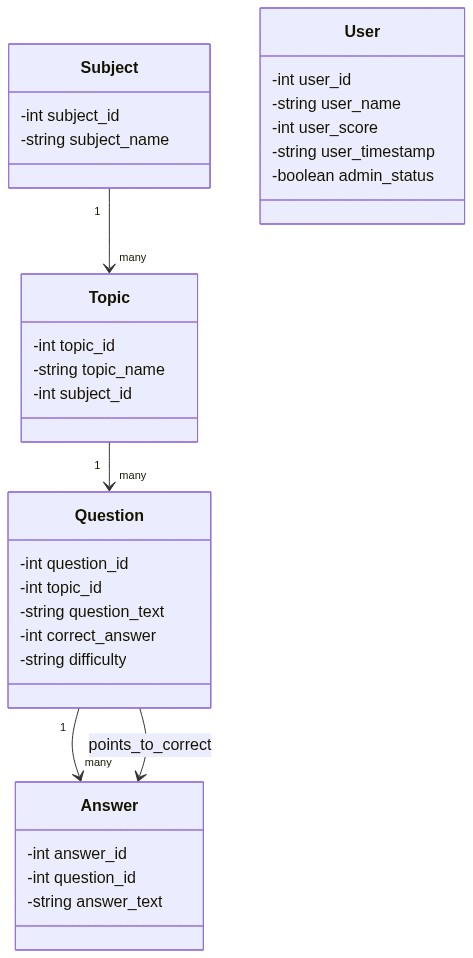
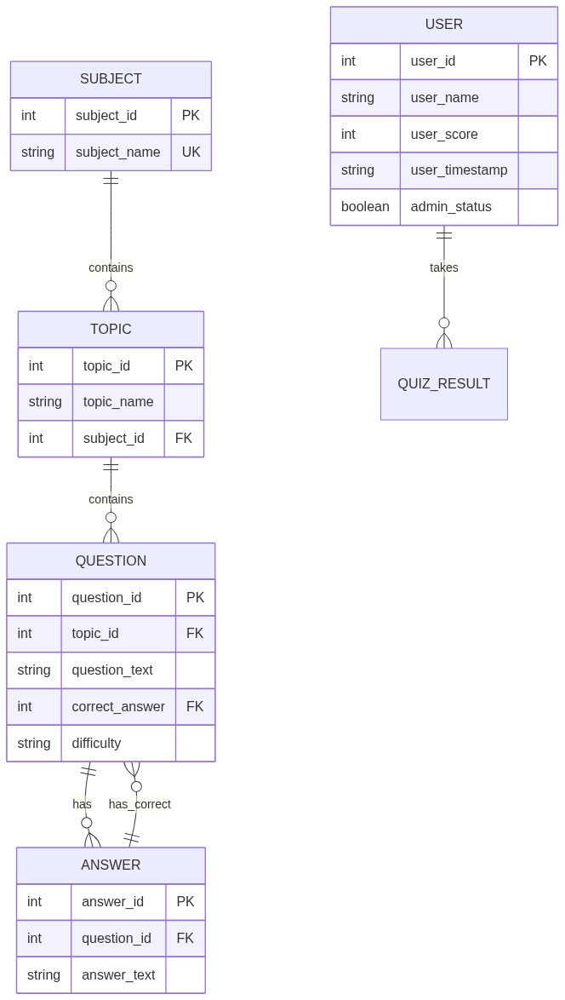

---

# 🐍 Big Snek Quiz - Advanced Programming Project

> 🚧 Replace the screenshot below with one that shows your main screen once the NiceGUI interface is complete.


---

This project is intended to:

- Practice the complete process from **application requirements analysis to implementation**
- Apply advanced **Python** concepts in a browser-based application (NiceGUI)
- Demonstrate **data validation**, a clean architecture (presentation / application logic / persistence), and **database access via ORM**
- Produce clean, well-structured, and documented code (incl. tests)
- Prepare students for **teamwork and professional documentation**

---

## 📝 Application Requirements

---

### Problem

> We learn a lot of material in this semester that is crucial to our further education. This can be overwhelming or even frightening. The material is spread over various Moodles / Inside FHNW, which is chaotic.

---

### Scenario

> To enhance the learning process we aim to create a catalogue of questions which will be presented as a quiz to prepare for our assessment exams. The quiz will be asking questions from one subject and split into chapters. The type of questions will be multiple choice. The answers will be validated and give an indication of right or wrong. At the end of the quiz, the user will be given a score and a Swiss grade (1–6 scale).

---

## User Stories

### 1. View Quiz Menu
**As a user, I want to be able to choose between Digital Business (DIB) Quizzes and Principles of Management (POM) Quizzes**  
**Description:** The application displays a menu and choice of quizzes for the user to select  
**Inputs:** The user can choose between available subjects  
**Outputs:** Confirmation of choice (internally calling selected quiz)

### 2. Select and run a quiz
**As a user, I want to be able to quiz my knowledge in DIB or POM**  
**Description:** The application displays a collection of quiz questions and a multiple choice selection of answers  
**Inputs:** Choice of an answer (four choices)  
**Outputs:** Confirmation of choice and correction if incorrect

### 3. Select the difficulty of quiz
**As a user, I want to select the difficulty of the previously selected subject in order to challenge and improve my current knowledge**  
**Description:** The application displays a menu with three possible difficulties (Easy, Medium and Hard) and an option for all difficulties combined  
**Inputs:** Choice of difficulty option (Easy / Medium / Hard / All difficulties)  
**Outputs:** Confirmation of choice (internally filtering questions by difficulty level)

### 4. Select the individual topics within the subject itself
**As a user, I want to select the topic within the previously selected subject and quiz my knowledge in the selected topics only in order to focus my learning goals and possible weaknesses**  
**Description:** The application displays available topics within the database  
**Inputs:** Choice of a single topic  
**Outputs:** Confirmation of choice (internally filtering questions by topic)

### 5. Quit and return to main menu
**As a user, I want to be able to return to the menu at any time in order to restart my quiz setup and the quiz itself**  
**Description:** At all times, during the quiz setup and the quiz attempt itself, the user has the possibility to return to the starting menu  
**Inputs:** User selects "Logout" from the menu  
**Outputs:** Returns to the login / main menu screen

### 6. Point Counter
**As a user, I want a point counter/final grade/percentage presented, in order to check my performance.**  
**Description:** The application displays the results of the finished attempt and shows the score (correct questions out of total), grade and percentage.  
**Inputs:** Internally recognizing the user's choice and incrementing counter if the correct choice is selected  
**Outputs:** Results saved to the database with score, timestamp, and Swiss grade (1–6 scale)

### 7. Scoreboard (Arcade Format)
**As a User, I want to be able to see my score in a scoreboard with other local users in order to compare my final attempt score with previous attempts**  
**Description:** Once an attempt is complete, the user is able to view a scoreboard with the top 10 results  
**Inputs:** Username (max 30 characters)  
**Outputs:** Scoreboard displaying rank, username, score and date (stored in SQLite database)

### 8. Admin Rights
**As an Admin, I want to be able to add and remove questions, in order to keep the quiz relevant.**  
**Description:** An admin user has access to a separate admin menu where subjects, topics, and questions can be added or deleted. Admins are identified by the `admin_status` flag set directly in the database.  
**Inputs:** Subject name, topic name, question text, 4 answer options, correct answer index (1–4), difficulty level (Easy / Medium / Hard)  
**Outputs:** Confirmation of changes; data is persisted immediately to the SQLite database

---

### Use Cases



**Main Use Cases**

- Show Menu
- Select Subject
- Select Parameters for Quiz
   - Select Topic
   - Select Difficulty
- Answer Questions
- Show result
   - Grade
   - Points
   - Percentage
- See the Scoreboard at the end of an attempt
- Return to Menu at any point in time
- As an Admin, have the ability to add questions
- As an Admin, have the ability to remove questions

**Actors**
- User (Attempts Quiz)
- Admin (May manage questions for the quiz)

---

### Wireframes / Mockups



---

## 🏛️ Architecture

Software Architecture (Layers)

```
┌─────────────────────┐
│   GUI Layer         │  ← NiceGUI (quiz_gui.py)
├─────────────────────┤
│   CLI Layer         │  ← quiz.py (command-line interface)
├─────────────────────┤
│  QuizEngine         │  ← Core quiz logic (quiz_engine.py)
│  QuizService        │  ← Database operations (quiz_service.py)
├─────────────────────┤
│  SQLModel + SQLite  │  ← Data persistence (DB_classes.py + quiz.db)
└─────────────────────┘
```

User Story Flow

```
┌──────────────────────────────────────────────────────────────────┐
│                    LOGIN / MAIN MENU                             │
├──────────────────────────────────────────────────────────────────┤
│  → User Mode (Stories 1-7)                                       │
│  → Admin Mode (Story 8)                                          │
└──────────────────────────────────────────────────────────────────┘
        │                                         │
        ▼                                         ▼
    ┌──────────────────────┐       ┌────────────────────────────┐
    │   USER MODE          │       │     ADMIN MODE             │
    ├──────────────────────┤       ├────────────────────────────┤
    │ 1. Select Subject    │       │ 1. Add Subject             │
    │    DIB or POM        │       │ 2. Add Topic               │
    │                      │       │ 3. Add Question            │
    │ 2. Select Difficulty │       │    - Question text         │
    │    Easy/Medium/Hard  │       │    - 4 Answers             │
    │    or All            │       │    - Correct answer        │
    │                      │       │    - Difficulty            │
    │ 3. Select # Questions│       │ 4. Delete Question         │
    │                      │       │ 5. Logout                  │
    │ 4. Run Quiz          │       │                            │
    │    - Display Q&A     │       │                            │
    │    - Validate answer │       │                            │
    │    - Show results    │       │                            │
    │    - Show grade      │       │                            │
    │                      │       │                            │
    │ 5. View Scoreboard   │       │                            │
    │    - Top 10 scores   │       │                            │
    │                      │       │                            │
    │ 6. Logout            │       │                            │
    └──────────────────────┘       └────────────────────────────┘
```

Database Schema (Hierarchical Structure)

```
Subject (subject areas)
├─ subject_id (primary key)
└─ subject_name (e.g., "Digital Business", "Principles of Management")

Topic (topics within subjects)
├─ topic_id (primary key)
├─ topic_name (e.g., "Digitalization", "Leadership")
└─ subject_id (foreign key → Subject)

Question (quiz questions)
├─ question_id (primary key)
├─ topic_id (foreign key → Topic)
├─ question_text (max 255 chars)
├─ correct_answer (foreign key → Answer.answer_id)
└─ difficulty ("easy", "medium", "hard")

Answer (possible answers for each question)
├─ answer_id (primary key)
├─ question_id (foreign key → Question)
└─ answer_text (max 255 chars)

User (accounts & quiz results)
├─ user_id (primary key)
├─ user_name (max 30 chars)
├─ user_score
├─ user_timestamp
└─ admin_status (boolean)
```

### Software Architecture



**Layers / components:**
- UI (NiceGUI pages/components, browser as thin client — `quiz_gui.py`)
- CLI Interface (command-line version — `quiz.py`)
- Application logic (quiz session management — `quiz_engine.py`)
- Service layer (database queries and CRUD — `quiz_service.py`)
- Persistence (SQLite + SQLModel ORM entities — `DB_classes.py`)

**Design decisions:**
- Organize code using **layered architecture**:
   - **Models:** ORM entities in `DB_classes.py` (Subject, Topic, Question, Answer, User)
   - **Service layer:** all database operations in `quiz_service.py`
   - **Engine:** stateful quiz session management in `quiz_engine.py`
   - **Interface:** CLI in `quiz.py`, NiceGUI in `quiz_gui.py`
- The engine and service layers are fully decoupled from the UI — both the CLI and NiceGUI call the same functions
- Business rules (grading, session tracking) are testable without starting the UI

**Design patterns used:**
- Layered Architecture (UI / Engine / Service / Persistence)
- Repository/DAO pattern for database access (`quiz_service.py`)
- Session pattern for quiz state management (`quiz_engine.py` + `ACTIVE_SESSIONS` dict)

---

### 🗄️ Database and ORM



**ORM and Entities:** Data is managed using **SQLModel** (built on SQLAlchemy + Pydantic). There are five entities:

- `Subject` — top-level subject areas (DIB, POM)
- `Topic` — chapters within a subject; linked to `Subject` via foreign key
- `Question` — quiz questions linked to a `Topic`; stores difficulty and a reference to the correct `Answer`
- `Answer` — possible answer options linked to a `Question`
- `User` — stores both user accounts (with `admin_status`) and quiz results (score + timestamp)

The database is pre-populated from the original JSON files using `DB/db_converter.py`.

---

## ✅ Project Requirements

Each app must meet the following criteria in order to be accepted (see also the official project guidelines PDF on Moodle):

1. Using NiceGUI for building an interactive web app
2. Data validation in the app
3. Using an ORM for database management

---

### 1. Browser-based App (NiceGUI)

The application interacts with the user via the browser. Users can:

- Log in or create a new account
- Select a subject (Digital Business or Principles of Management)
- Select a difficulty level (Easy / Medium / Hard / All)
- Choose the number of questions
- Answer multiple-choice questions with immediate feedback
- See their final score, percentage, and Swiss grade (1–6)
- View the top 10 scoreboard

**Architecture note (per SS26 guidelines):** the browser is a thin client; UI state + business logic live on the server-side NiceGUI app.

---

### 2. Data Validation

The application validates all user input to ensure data integrity and a smooth user experience:

- Username cannot be empty; max 30 characters
- Answer choice must be a valid number within the available range
- Number of questions must be between 5 and the total available (prevents requesting more questions than exist)
- Admin inputs (question text, answers, difficulty) are validated before writing to the database
- All validation prevents crashes and guides the user to provide correct input

---

### 3. Database Management

All data is managed via **SQLModel** (ORM built on SQLAlchemy). This includes subjects, topics, questions, answers, and user results. The database is a local SQLite file (`Project_PF_Phase_2/DB/quiz.db`).

---

## ⚙️ Implementation

---

### Technology

- Python 3.11
- Environment: GitHub Codespaces
- External libraries: `nicegui`, `sqlmodel`, `sqlalchemy`, `tzdata`

---

### 📂 Repository Structure

```text
Project_PF_adv/
├─ README.md
│
├─ Project_PF_Phase_2/
│  ├─ quiz.py              # CLI entry point (User + Admin modes)
│  ├─ quiz_gui.py          # NiceGUI entry point (browser interface)
│  ├─ quiz_engine.py       # Core quiz session logic
│  ├─ quiz_service.py      # All database operations (CRUD + queries)
│  ├─ DB_classes.py        # SQLModel ORM entities
│  │
│  └─ DB/
│     ├─ quiz.db           # SQLite database
│     ├─ db_converter.py   # One-time JSON → SQLite migration script
│     ├─ check_db.py       # Database inspection utility
│     └─ Legacy Files/
│        ├─ DIB.json       # Original Digital Business questions
│        └─ POM.json       # Original Principles of Management questions
│
├─ docs/
│  ├─ ui-images/
│  │  ├─ ui_showcase.png
│  │  └─ wireframes.png
│  │
│  └─ architecture-diagrams/
│     ├─ 01_ER_Diagram.png
│     ├─ 02_Class_Diagram.png
│     ├─ 03_Architecture_Diagram.png
│     ├─ 04_Sequence_Diagram.png
│     ├─ 05_UseCase_Diagram.png
│     └─ UML_use_case_diagram_quiz.png
│
└─ Project_PF (Phase_1)/   # Original Phase 1 implementation (CLI only)
```

---

### How to Run

#### 1. Project Setup
- Python 3.11 is required
- No virtual environment setup needed in GitHub Codespaces (dependencies are pre-installed)
- If running locally, install dependencies:
   ```bash
   pip install nicegui sqlmodel tzdata
   ```

#### 2. Launch — CLI Version
```bash
cd Project_PF_Phase_2
python quiz.py
```
Follow the prompts to log in and start a quiz.

#### 3. Launch — NiceGUI (Browser) Version
```bash
cd Project_PF_Phase_2
python quiz_gui.py
```
Open the URL shown in the terminal (typically `http://localhost:8080`).

#### 4. Usage

**Taking a Quiz:**
1. Enter your username to log in (account is created automatically if new).
2. Select a subject (Digital Business or Principles of Management).
3. Select a difficulty level (Easy / Medium / Hard / All difficulties).
4. Choose how many questions you want to answer.
5. Answer each question by selecting option 1–4.
6. After each answer, feedback is shown immediately (correct/incorrect).
7. At the end, your score, percentage, and Swiss grade (1–6) are displayed.

**Viewing Scores:**
- Select "View Scoreboard" from the user menu to see the top 10 results.

**Admin Mode:**
- Admin accounts are set via the `admin_status` flag in the database.
- Admins can add/delete subjects, topics, and questions from the admin menu.

> 🚧 Add UI screenshots of the main screens once the NiceGUI interface is complete.

---

## 🧪 Testing

> 🚧 Tests are not yet implemented. Below is the planned test structure.

**Planned test mix:**
- Unit tests: Swiss grade calculation, question count validation, session score tracking
- DB tests: subject/topic/question queries return correct data, saving a quiz result persists to database
- Integration tests: complete quiz flow from login → quiz → results → scoreboard

**Template for writing test cases:**
1. Test case ID – unique identifier (e.g., TC_001)
2. Test case title/description – What is the test about?
3. Preconditions: Requirements before executing the test
4. Test steps: Actions to perform
5. Test data/input
6. Expected result
7. Actual result
8. Status – pass or fail
9. Comments – Additional notes or defect found

**Run:**
```bash
pytest
```

---

### Libraries Used

| Library | Version | Purpose |
|---------|---------|---------|
| nicegui | 3.9.0 | Browser-based UI framework |
| sqlmodel | 0.0.38 | ORM for database access |
| sqlalchemy | (via sqlmodel) | Database engine |
| tzdata | latest | Timezone support (Europe/Zurich) |

---

## 👥 Team & Contributions

---

| Name              | Role     | Contribution                               |
|-------------------|----------|--------------------------------------------|
| Steven Joggi      | Support  | 1) User Stories and Use Cases (including Use Case Diagram)
|                   |          | 2) ER Diagram Continuation
|                   |          | 3) 
|                   |          | 4) 
|                   |          | 5) 
|                   |          | 6) Proofreading and added comments for structure
|                   |          | 7) Continuation of README.md 
|                   |          |  
| Noe Brönnimann    | VP       | 1) User Stories and Use Cases (including Use Case Diagram)
|                   |          | 2) ER Diagram Continuation
|                   |          | 3) 
|                   |          | 4) 
|                   |          | 5) 
|                   |          | 6) 
|                   |          | 7) Correction of Steven's code
|                   |          | 
| Christian Lehmann | Master   | 1) User Stories and User Story Flow
|                   |          | 2) Created the db_converter.py
|                   |          | 3) Created the quiz_engine.py
|                   |          | 4) Created the quiz_service.py
|                   |          | 5) Restructured the database into ORM classes (DB_classes.py)
|                   |          | 6) Created the CLI interface (quiz.py)
|                   |          | 7) Overall troubleshooting and architecture design

---

## 🤝 Contributing

- Use this repository as a starting point by importing it into your own GitHub account
- Work only within your own copy — do not push to the original template
- Commit regularly to track your progress

---

## 📝 License

---

This project is provided for **educational use only** as part of the Advanced Programming module.

[MIT License](LICENSE)
