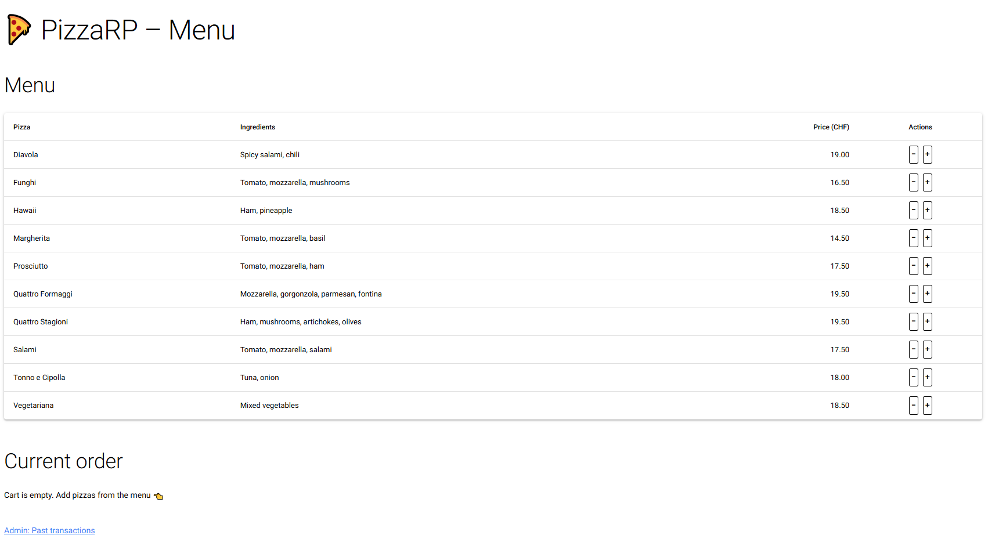
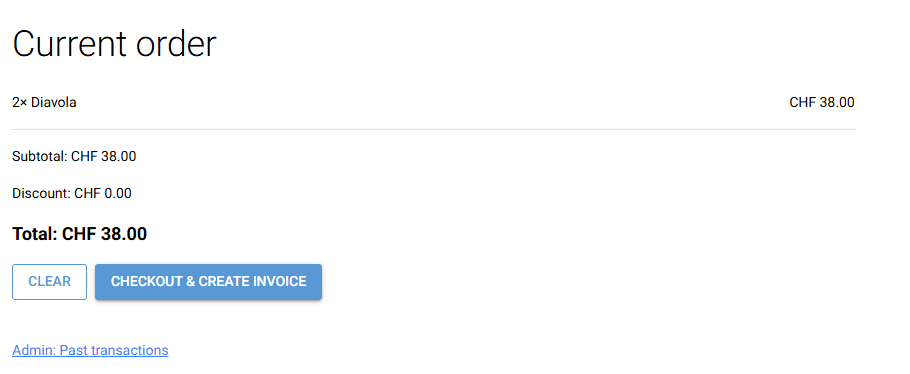
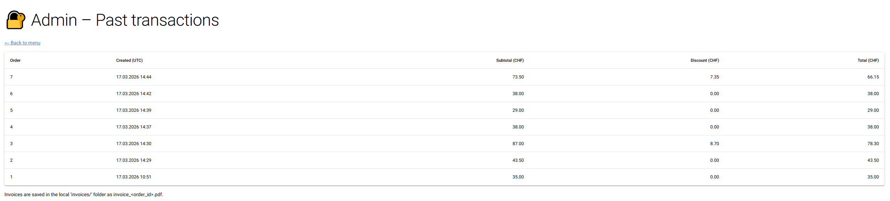

---

# 🐍 Big Snek Quiz - Advanced Programming Project

> 🚧 Replace the screenshot with one that shows your main screen.



---

This project is intended to:

- Practice the complete process from **application requirements analysis to implementation**
- Apply advanced **Python** concepts in a browser-based application (NiceGUI)
- Demonstrate **data validation**, a clean architecture (presentation / application logic / persistence), and **database access via ORM**
- Produce clean, well-structured, and documented code (incl. tests)
- Prepare students for **teamwork and professional documentation**
- Use this repository as a starting point by importing it into your own GitHub account  
- Work only within your own copy — do not push to the original template  
- Commit regularly to track your progress

---

# 🍕 TEMPLATE for documentation

> 🚧 Please remove the paragraphs marked with "🚧". These are comments for preparing the documentation.

---

## 📝 Application Requirements

---

### Problem *Added from Phase 1*

> We learn a lot of material in this semester that is crucial to our further education. This can be overwhelming or even frightening. The material is spread over various Moodles / Inside FHNW, which is chaotic.

---

### Scenario *Added  from Phase 1*

> To enhance the learning process we aim to crate a catalouge of questions which will be presented as a quiz to prepare for our assesment exams. The quiz will be asking questions from one subject and split into chapters. The type of questions will be mulitple choice. The Answers will be validated and give an indication of right or wrong. At the end of the quiz, the user will be given a score.

---

## User Stories

### 1. View Quiz Menu
**As a user, I want to be able to choose between Digital Business (DIB) Quizes and Principles of Management (POM) Quizes**  
**Description:** The application displays a menu and choice of quizes for the user to select
**Inputs:**  The user can choose between two types of quizes
**Outputs:** Confirmation of choice (internally calling selected quiz) 

### 2. Select and run a quiz 
**As a user, I want to be able to quiz my knowledge in DIB or POM**  
**Description:** The application displays a collection of quiz questions and the a multiple choice selection of answers  
**Inputs:**  Choice of an answer (Four choices) 
**Outputs:** Confirmation of choice and correction if incorrect (internally: "list[attempt_answers]) 

### 3. Select the difficulty of quiz 
**As a user, I want to select the difficulty of the previously selected subject in order to challenge and improve my current knowledge**  
**Description:** The application displays a menu with three possible difficulties (Easy, Medium and Hard) and a choice for a random selection of questions for the user to select and proceed with
**Inputs:**  Choice of difficulty option (Three choices plus random choice)
**Outputs:** Confirmation of choice (internally calling the next step in quiz_setup)

### 4. Select the individual topics within the subject itself
**As a user, I want to select the topic within the previously selected subject and quiz my knowledge in the selected topics only in order to focus my learning goals and possible weaknesses**  
**Description:** The application displays available topics within the database in a menu, including a random option of questions 
**Inputs:**  Choice of a single topic 
**Outputs:** Confirmation of choice (internally calling the next step in quiz_setup)

### 5. Select the amount of questions the user can complete in their attempt
**As a user, I want to select the amount of questions I can attempt in my quiz**  
**Description:** The application displays an option to select an amount of questions
**Inputs:**  Choice of a number of questions (minimum of 5 questions)
**Outputs:** Confirmation of choice (internally calling the next step in quiz_setup)

### 6. Quit and return to main menu 
**As a user, I want to able to return to the menu at anytime in order to restart my quiz setup and the quiz itself**  
**Description:** At all times, during the quiz setup and the quiz attempt itself, the user has the possibility to return to the starting menu
**Inputs:**  User has a return choice
**Outputs:** Confirmation of choice (internally, stop attempt and return to )

### 7. Point Counter
**As a user, I want a point counter/final grade/percentage presented, in order to check my performance.**  
**Description:** The application displays the results of the finished attempt and shows the score (correct questions out of total), grade and percentage.
**Inputs:**  internally recognizing the users choice and adding to counter if correct choice has been selected
**Outputs:** internally calling the results.csv and creating a new entry with achieved score, date, time, final grade and percentage reached 

### 8. Scoreboard (Arcade Format)
**As a User, I want to be able to see my score in a scoreboard with other local users in order to compare my final attempt score with previous attempts**  
**Description:** Once an attempt is complete, the user is able to view their score and input a user name into a scoreboard
**Inputs:**  Username entry ("str" and limited characters, excluding special characters)
**Outputs:** Confirmation of choice (internally: results.csv)

### 9. Admin Rights
**As an Admin, I want to be able to add and remove questions, in order to keep the quiz relevant.**  
**Description:** In the form of an Admin Panel, the Admin has the ability to delete questions from the database and also can add questions, including assigning them to a subject, topic and difficulty. 
**Inputs:**  Admin Password (Hardcoded) and input from admin user
**Outputs:** Confirmation of Update including deletion


### Use cases

![UML Use Case Diagram]

**Use cases**
## Main Use Cases

- Show Menu
- Select Subject 
- Select Parameters for Quiz
   - Select Topic(s)
   - Select Difficulty
   - Select Number of Questions
- Answer Questions
   - Receive an Explanation if incorrect answer was made
- Show result 
   - Grade 
   - Points 
   - Percentage
- See the Scoreboard at the end of an attempt
- Return to Menu at any point in time
- As an Admin, have the ability to add questions
- As an Admin, have the ability to remove questions


**Actors**
- User (Attempts Quiz)
- Admin (Manage questions for the quiz)

---

### Wireframes / Mockups

> 🚧 Add screenshots of the wireframe mockups you chose to implement.

![Wireframes – Home/Transactions]

---

## 🏛️ Architecture

Software Architecture (Layers)
┌─────────────────────┐
│   GUI Layer         │  ← Nice GUI
├─────────────────────┤
│   quiz.py (CLI)     │  ← User interface
├─────────────────────┤
│  Services (Folder)  │  ← Core quiz logic (reusable)
│                     │  ← Database operations
├─────────────────────┤
│  SQLModel + SQLite  │  ← Data persistence
└─────────────────────┘

## 🧪 Tests

The repository now includes a separate `test/` folder for pytest-based checks.

Install the dev dependency and run the suite with:

```bash
pip install -r requirements-dev.txt
pytest
```

The starter tests avoid the live database and use in-memory or temporary SQLite files instead.

User Story Flow (Now with Subject Selection)

┌──────────────────────────────────────────────────────────────────┐
│                    MAIN MENU                                     │
├──────────────────────────────────────────────────────────────────┤
│  1. User Mode (Stories 1-7)                                      │
│  2. Admin Mode (Story 8)                                         │
│  3. Exit                                                         │
└──────────────────────────────────────────────────────────────────┘
        │                                         │
        ▼                                         ▼
    ┌──────────────────────┐       ┌────────────────────────────┐
    │   USER MODE          │       │     ADMIN MODE             │
    ├──────────────────────┤       ├────────────────────────────┤
    │ 1. Select Subject    │       │ 1. Add Question (S8)       │
    │    (Story 1)         │       │    - Select subject/topic  │
    │    DIB or POM        │       │    - Question text         │
    │                      │       │    - 4 Answers             │
    │ 2. Select Topic      │       │    - Correct answer        │
    │    (Story 4)         │       │    - Explanation           │
    │    (from selected    │       │    - Difficulty            │
    │     subject)         │       │                            │
    │                      │       │ 2. Remove Question (S8)    │
    │ 3. Select Difficulty │       │    - Select Question ID    │
    │    (Story 3)         │       │    - Confirmation of       │
    │    Easy/Medium/Hard  │       │      Termination           │
    │                      │       │                            │
    │ 4. Run Quiz          │       │ 3. Return to Main          │
    │    (Story 2)         │       │                            │
    │    - Display Q&A     │       │ 4. Exit                    │
    │    - Validate answer │       │                            │
    │    - Show results    │       │                            │
    │                      │       │                            │
    │ 5. View Scoreboard   │       │                            │
    │    (Story 7)         │       │                            │
    │    - Top scores      │       │                            │
    │                      │       │                            │
    │ 6. Exit              │       │                            │
    │                      │       │                            │
    │ (S1-S7)              │       │                            │
    └──────────────────────┘       └────────────────────────────┘


Database Schema (Hierarchical Structure)

Subject (subject areas)
├─ subject_id (primary key)
└─ subject_name (e.g., "Digital Business", "Principles of Management")

Topic (topics within subjects)
├─ topic_id (primary key)
├─ topic_name (e.g., "Digitalization", "Leadership")
└─ subject_id (foreign key → Subject)

Question (quiz questions)
├─ question_id
├─ topic_id (foreign key → Topic)
├─ question_text
├─ correct_answer (foreign key → Answer.answer_id)
└─ difficulty ("easy", "medium", "hard")

Answer (possible answers for each question)
├─ answer_id
├─ question_id (foreign key → Question)
└─ answer_text

User (quiz results & admin accounts)
├─ user_id (primary key)
├─ user_name (max 30 chars)
├─ user_score
├─ user_timestamp
└─ admin_status (boolean)


### Software Architecture

> 🚧 Insert your UML class diagram(s). Split into multiple diagrams if needed.

![UML Class Diagram] -> Diagrams.md

**Layers / components:**
- UI (NiceGUI pages/components, browser as thin client)
- Application logic (controllers + domain/services)
- Persistence (SQLite + ORM entities + repositories/queries)

**Design decisions (examples):**                                     #confused here
- Organize code using **MVC**:
   - **Model:** domain + ORM entities (e.g. `quiz.py`)
   - **View:** NiceGUI UI components/pages
   - **Controller:** event handlers and coordination logic between UI, services, and persistence (e.g.`quiz_service.py` )
- Separate UI (`app/main.py`) from domain logic (e.g. ``) and persistence (e.g. `models.py`, `db.py`)
- Use and interaction of modules to minimize dependencies, by minimizing cohesion and maximizing coupling
- Keep business rules testable without starting the UI

**Design patterns used (examples):**
- MVC (Model–View–Controller)
- Repository/DAO for database access (e.g. `queries.py`)
- Strategy for business rules (e.g. discount calculation)
- Adapter for external services (e.g. invoice generation backend)

---

### 🗄️ Database and ORM

> 🚧 Describe the database and your ORM entities. Ideally, a diagram documents the database and it is described together with the ORM entities.

![ER Diagram] -> Diagrams.md

**ORM and Entities (example):** In our project, data is persisted in an SQLite database and mapped to Python entities using SQLModel (ORM). The core entities are Subject, Topic, Question, Answer, User, and QuizResult. 
The relationship chain:

                     Subject -> Topic -> Question -> Answer 

ensures hierarchical quiz data integrity: each Topic belongs to one Subject, each Question belongs to one Topic, and each Answer belongs to one Question. 
In addition, Question.correct_answer references a valid Answer entry. User-related data is managed through User (account/admin information) and QuizResult (stored scores and attempt results).

---

## ✅ Project Requirements

---

> 🚧 Requirements act as a contract: implement and demonstrate each point below.

Each app must meet the following criteria in order to be accepted (see also the official project guidelines PDF on Moodle):

1. Using NiceGUI for building an interactive web app
2. Data validation in the app
3. Using an ORM for database management

---

### 1. Browser-based App (NiceGUI)

> 🚧 In this section, document how your project fulfills each criterion.

The application interacts with the user via the browser. Users can:

- Login through a username of their choice
- Select "Start Quiz"
- Select the parameters of their quiz, including subject, topic, difficulty and number of questions
- End their quiz at any time and still receive a grading based on achieved progress
- View their score and compare it to previous and other users in "View Scoreboard"

- Admins can log in through a (hardcoded) password
- Admins have access to the Admin Panel and can manage questions (Add and Remove)
- The added or removed questions are linked to the database.

**Architecture note (per SS26 guidelines):** the browser is a thin client; UI state + business logic live on the server-side NiceGUI app.

---

### 2. Data Validation

The application validates all user input to ensure data integrity and a smooth user experience.
These checks prevent crashes and guide the user to provide correct input, matching the validation requirements described in the project guidelines.

---

### 3. Database Management

All relevant data is managed via an ORM (SQLModel). This Includes, "subjects, "topics", "question", "answer", "user", and " QuizResult" and "QuizSession".

---

## ⚙️ Implementation

---

### Technology

- Python 3.13.5
- Environment: GitHub Codespaces
- External libraries: nicegui, sqlmodel, sqlalchemy, pytest

---

### 📂 Repository Structure

PROJECT_PF_ADV/
├─ .devcontainer
│  ├─ devcontainer.json
│  └─ Dockerfile 
├─ .pytest_cache
├─ .venv
├─ .vscode
├─ .docs
│  ├─ architecture-diagrams
│  │  └─ DIAGRAMS.md
│  └─ ui-images
│     └─ FIGMA_DESIGN_SPEC.md
│
├─ Project_PF (Phase 1)             #Previous Semester's Project (Autumn 2025)
│  ├─ devcontainer
│  │   └─ devcontainer.json
│  │   └─ Dockerfile
│  ├─ Data
│  │   └─ DIB.json
│  │   └─ POM.json
│  ├─ Pictures
│  │   └─ application.arcitecture_v1.jpg
│  ├─ .gitignore
│  ├─ main.py
│  ├─ quiz.py
│  ├─ README.md
│  └─ requirements.txt
│
├─ Project_PF (Phase 2)  
│  ├─ data_access             
│  │  ├─ __pycache__
│  │  ├─ __init__.py
│  │  ├─ db.py
│  │  ├─ question_dao.py
│  │  ├─ score_dao.py
│  │  ├─ subject_dao.py
│  │  └─ user_dao.py
│  ├─ DB
│  │  ├─ Legacy Files
│  │  │  ├─ DIB.json
│  │  │  └─ POM.json
│  │  ├─ check_db.py
│  │  ├─ db_converter.py
│  │  └─ quiz.db
│  ├─ domain
│  │  ├─ __pycache__
│  │  ├─ __init__.py
│  │  └─ models.py
│  ├─ services
│  │  ├─ __pycache__
│  │  ├─ __init__.py
│  │  ├─ question_service.py
│  │  ├─ quiz_session_service.py
│  │  ├─ score_service.py
│  │  ├─ subject_session_service.py
│  │  └─ user_service.py
│  ├─ test
│  │  ├─ __pycache__
│  │  ├─ conftest.py
│  │  ├─ pytest.ini
│  │  ├─ test_database.py
│  │  ├─ test_integration.py
│  │  └─ test_unit.py
│  ├─ ui
│  │  ├─ __pycache__
│  │  ├─ __init__.py
│  │  ├─ cli.py
│  │  └─  gui.py
│  ├─ __main__.py                   # entrypoint
│  ├─ class.md
│  └─ DESIGN_DECISIONS.md
├─ README.md
├─ requirements-dev.txt
└─ requirements.txt

---

### How to Run

> 🚧 Adjust to your project.

### 1. Project Setup
- Python 3.13 (or the course version) is required
- Create and activate a virtual environment:
   - **macOS/Linux:**
      ```bash
      python3 -m venv .venv
      source .venv/bin/activate
      ```
   - **Windows:**
      ```bash
      python -m venv .venv
      .venv\Scripts\Activate
      ```
- Install dependencies:
   ```bash
   pip install -r requirements.txt
   pip install -r requirements-dev.txt #specifically for Pytesting
   ```

### 2. Configuration
- E.g., setup of parameters or environment variables

### 3. Launch
- Start the NiceGUI app in __main__.py by running the programm as a Python File. 
   

### 4. Usage (document as steps)

> 🚧 Describe the usage of the main functions

Doing a Quiz:
1. Login with a Username of your choice
2. Select "Start Quiz"
3. Set Parameters including what subject, which topics, difficulty and number of questions (minimum of 5).
4. Start Attempt 
5. Once the Attempt has been completed, either by answering all the questions or quitting the quiz beforehand, the user is shown their results, including their achieved points, percentage and grade. 
6. The user may compare their score to previous attempts or other users in "View Scoreboard". 

> 🚧 Add UI screenshots of the main screens (or a short video link):




---

## 🧪 Testing

> 🚧 Explain what you test and how to run tests.

**Test mix:**
- Overall 12 tests
- 6 Unit tests: e.g. subtotal calculation, discount application above CHF 50, no discount at or below threshold, total calculation
- 3 DB tests: e.g. menu query returns seeded pizzas, saving an order persists order + order items, empty DB / empty transactions behavior
- 3 Integration tests: e.g. checkout with one pizza creates order and invoice, checkout with multiple pizzas applies discount correctly

**Template for writing test cases**
1. Test case ID – unique identifier (e.g., TC_001)
2. Test case title/description – What is the test about?
3. Preconditions: Requirements before executing the test
4. Test steps: Actions to perform
5. Test data/input
6. Expected result
7. Actual result
8. Status – pass or fail
9. Comments – Additional notes or defect found

**Run:**
```bash
pytest  #dini mami
```

> 🚧 If you provide separate commands, document them here (e.g. `pytest -m integration`).

---

### Libraries Used

1. sqlmodel
2. nicegui
3. pytest
4. os
5. sys
6. json
7. random
8. uuid
9. datetime
10. zoneinfo
11. sqlite3
12. pathlib
13. typing

## 👥 Team & Contributions

---

| Name              | Role     | Contribution                               |
|-------------------|----------|--------------------------------------------|
| Steven Joggi      | NiceGuy  | 1) User Stories and Use Cases
|                   |          | 2) ER Diagram Continuation
|                   |          | 3) Initial set-up of NiceGUI
|                   |          | 4) Initial set-up of Pytest
|                   |          | 5) 
|                   |          | 6) Proofreading and added comments for structure
|                   |          | 7) Continuation of README.md 
|                   |          |  
| Noe Brönnimann    | VP       | 1) User Stories and Use Cases
|                   |          | 2) ER Diagram Continuation
|                   |          | 3) Continuation of NiceGUI
|                   |          | 4) Continuation of Pytest
|                   |          | 5) 
|                   |          | 6) 
|                   |          | 7) Correction of Steven's code
|                   |          | 
| Christian Lehmann | Master   | 1) User Stories and User Story Flow
|                   |          | 2) Created the db.converter
|                   |          | 3) Created the quiz_engine.py
|                   |          | 4) Created the quiz_service.py
|                   |          | 5) Restructured the Database into classes
|                   |          | 6) Major Overhaul of Code and Restructure (13.05.2026)
|                   |          | 7) Overall Troubleshooting of Noe's and Steven's code


---

## 🤝 Contributing

---

> 🚧 This is a template repository for student projects.  
> 🚧 Do not change this section in your final submission.

- Use this repository as a starting point by importing it into your own GitHub account
- Work only within your own copy — do not push to the original template
- Commit regularly to track your progress

---

## 📝 License

---

This project is provided for **educational use only** as part of the Advanced Programming module.

[MIT License](LICENSE)
