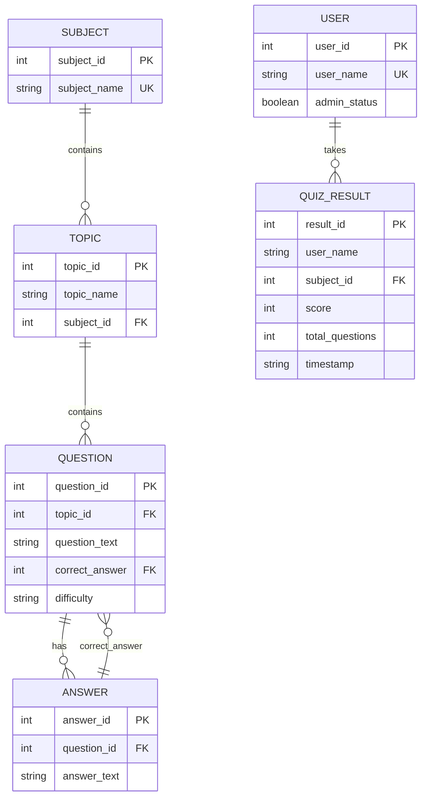
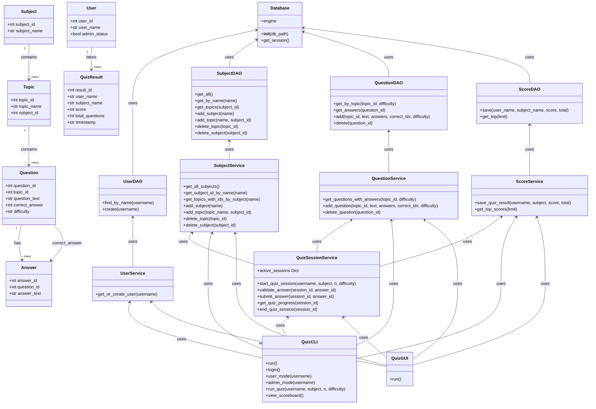
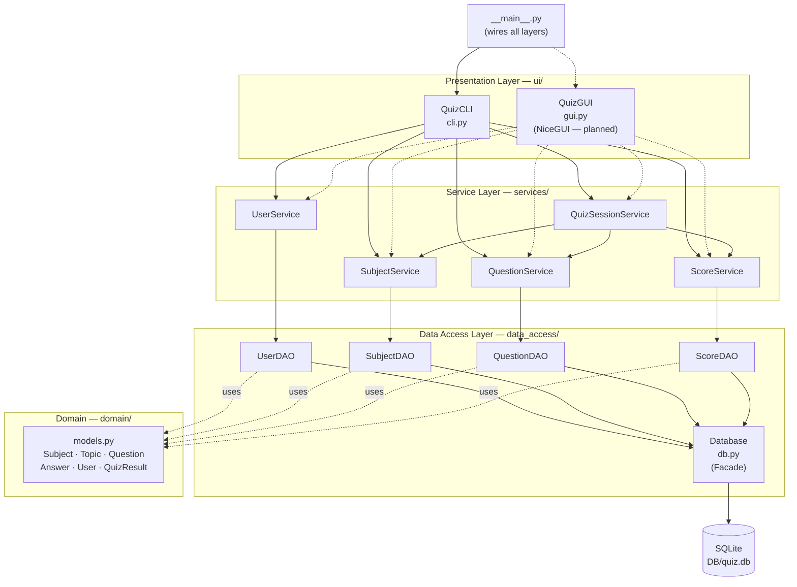
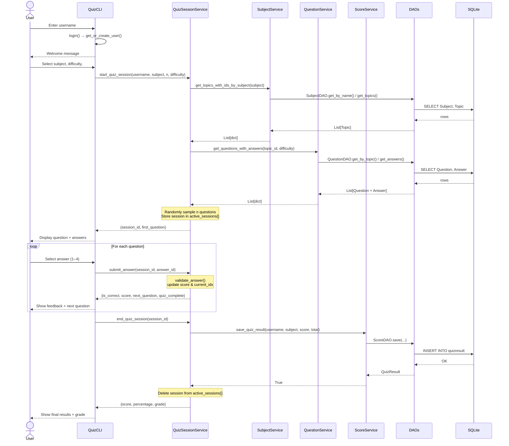
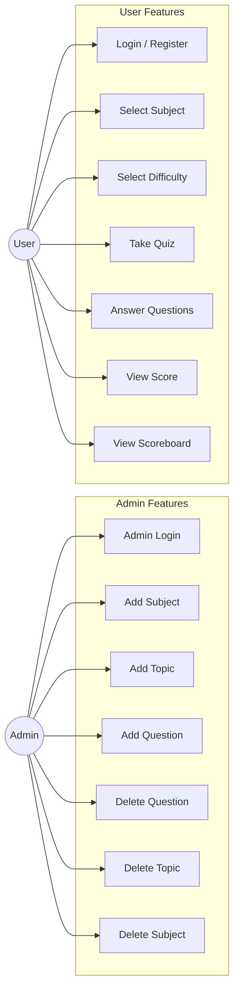

# Architecture Diagrams

All diagrams reflect the current project structure after the OOP/N-Tier refactor.
Paste any block into [mermaid.live](https://mermaid.live) to export as PNG.

---

## 01 — ER Diagram

> Shows all database tables, their fields, and relationships.
> `QuizResult` is now a separate table — quiz scores are no longer stored in `User`.

---

## 02 — Class Diagram

> Shows all classes across all layers and how they depend on each other.
> Calls flow downward (UI → Service → DAO → DB). Data returns upward.

---

## 03 — N-Tier Architecture Diagram

> Shows the four layers and the single entry point (`__main__.py`).
> Dashed arrows = planned (NiceGUI, to be implemented).

---

## 04 — Sequence Diagram: Take a Quiz

> Shows the complete flow when a user takes a quiz, from login to final score.
> Key change: results are saved to `QUIZ_RESULT`, not `USER`.

---

## 05 — Use Case Diagram

> Shows all features available to each actor. No code changes affect this diagram.

